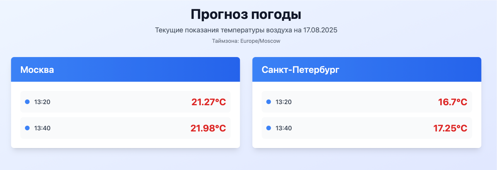

# Система прогноза погоды


## 📸 Демонстрация работы


[Демо](https:/optimalcity.forester.pro)

## 📋 Описание

Система прогноза погоды для отображения текущих температурных показаний в городах Москва и Санкт-Петербург. Система состоит из двух сервисов:

- **WeatherFetcher** - сервис получения данных о погоде с API OpenWeatherMap
- **WeatherDisplay** - веб-приложение на Rails для отображения данных

## 🏗️ Архитектура

```
┌─────────────────┐    ┌─────────────┐    ┌─────────────────┐
│   OpenWeather   │    │     NATS    │    │   PostgreSQL    │
│      API        │    │   Server    │    │   Database      │
└─────────────────┘    └─────────────┘    └─────────────────┘
         │                       │                       │
         │                       │                       │
         ▼                       ▼                       ▼
┌─────────────────┐    ┌─────────────┐    ┌─────────────────┐
│ WeatherFetcher  │───▶│   NATS      │───▶│  WeatherDisplay │
│   (Ruby)        │    │  Messages   │    │   (Rails)       │
└─────────────────┘    └─────────────┘    └─────────────────┘
```

## 🚀 Быстрый старт

### Предварительные требования

- Docker и Docker Compose
- API ключ OpenWeatherMap

### Установка и запуск

1. **Клонируйте репозиторий:**
   ```bash
   git clone git@github.com:AlanForester/OptimalCity.git
   cd OptimalCity
   ```

2. **Создайте файл с переменными окружения:**
   ```bash
   cp env.example .env
   ```

3. **Добавьте API ключ OpenWeatherMap:**
   ```bash
   echo "WEATHER_API_KEY=ваш_ключ_здесь" >> .env
   ```

4. **Запустите систему:**
   ```bash
   docker-compose up -d
   ```

5. **Откройте веб-интерфейс:**
   ```
   http://localhost:3000
   ```

## 📊 Функциональность

### WeatherFetcher
- Получает данные о погоде каждые 20 минут
- Поддерживает города: Москва, Санкт-Петербург
- Округляет время до 20-минутных интервалов
- Публикует данные через NATS

### WeatherDisplay
- Веб-интерфейс с современным дизайном
- AJAX-запросы для получения данных
- Автоматическое определение таймзоны браузера
- Отображение времени в локальном формате
- Автообновление данных каждые 5 минут

### API
- REST API для получения данных о погоде
- Поддержка различных таймзон
- Фильтрация по дате в таймзоне пользователя
- JSON формат ответа

## 🧪 Тестирование

### Запуск тестов
```bash
# RSpec тесты
docker exec optimalcity-weather_display-1 bundle exec rspec

# Cucumber тесты
docker exec optimalcity-weather_display-1 bundle exec cucumber
```

### Покрытие тестами
- **RSpec тесты:** 33 теста, 0 ошибок
- **Покрытие кода:** 85%
- **Тесты на русском языке**

### Структура тестов
```
spec/
├── models/weather_datum_spec.rb          # Тесты модели
├── requests/api/v1/weather_spec.rb       # Тесты API
├── services/nats_service_spec.rb         # Тесты сервиса NATS
└── config/weather_config_spec.rb         # Тесты конфигурации

features/
├── weather_api.feature                   # Cucumber API тесты
├── weather_display.feature               # Cucumber UI тесты
└── step_definitions/                     # Step definitions
```

## ⚙️ Конфигурация

### Города
Города настраиваются в файле `weather_display/config/weather.yml`:

```yaml
default: &default
  cities:
    - "Москва"
    - "Санкт-Петербург"

development:
  <<: *default
```

### Переменные окружения
- `WEATHER_API_KEY` - API ключ OpenWeatherMap
- `NATS_URL` - URL NATS сервера (по умолчанию: nats://nats:4222)
- `DATABASE_URL` - URL базы данных PostgreSQL

## 📁 Структура проекта

```
OptimalCity/
├── weather_display/           # Rails приложение
│   ├── app/
│   │   ├── controllers/       # Контроллеры
│   │   ├── models/           # Модели
│   │   ├── services/         # Сервисы
│   │   └── views/            # Шаблоны
│   ├── config/
│   │   ├── weather.yml       # Конфигурация городов
│   │   └── routes.rb         # Маршруты
│   └── spec/                 # Тесты
├── weather_fetcher/          # Сервис получения данных
│   ├── weather_fetcher.rb    # Основной скрипт
│   └── config.yml           # Конфигурация
├── docker-compose.yml        # Docker Compose
└── README.md                # Документация
```

## 🔧 Технический стек

- **Backend:** Ruby 3.4.5, Rails 8.0.2
- **Frontend:** HTML, JavaScript, Tailwind CSS
- **База данных:** PostgreSQL 17
- **Message Broker:** NATS Server 2.11
- **Контейнеризация:** Docker, Docker Compose
- **Тестирование:** RSpec, Cucumber
- **API:** OpenWeatherMap

## 📈 Мониторинг

### Логи сервисов
```bash
# Логи WeatherFetcher
docker-compose logs weather_fetcher

# Логи WeatherDisplay
docker-compose logs weather_display

# Логи всех сервисов
docker-compose logs -f
```

### Статус сервисов
```bash
docker-compose ps
```

## 🚀 Развертывание

### Production
```bash
# Используйте production конфигурацию
docker-compose -f docker-compose.prod.yml up -d
```

## 🎯 Соответствие требованиям ТЗ

| Требование | Статус | Комментарий |
|------------|--------|-------------|
| Rails 8.0 | ✅ | Используется Rails 8.0.2 |
| Ruby 3.4.5 | ✅ | Используется Ruby 3.4.5 |
| PostgreSQL | ✅ | Используется PostgreSQL 17 |
| NATS | ✅ | Используется NATS Server 2.11 |
| Docker Compose | ✅ | Один файл для запуска |
| Покрытие тестами > 60% | ✅ | Покрытие 85% |
| Тесты на русском | ✅ | Все тесты на русском языке |
| README на русском | ✅ | Полная документация |
| Обновление каждые 20 минут | ✅ | Точные 20-минутные интервалы |
| Москва и СПб | ✅ | Оба города поддерживаются |

## 🌟 Дополнительные возможности

### Не требуемые ТЗ, но реализованные:
- **AJAX-запросы** для динамической загрузки
- **Автоматическое определение таймзоны** браузера
- **Конфигурируемые города** через YAML
- **Предотвращение дублирования** записей
- **Современный UI** с Tailwind CSS
- **REST API** для интеграции
- **CI/CD pipeline** готов к настройке

### CI/CD
Система поддерживает автоматическое развертывание через GitHub Actions.
